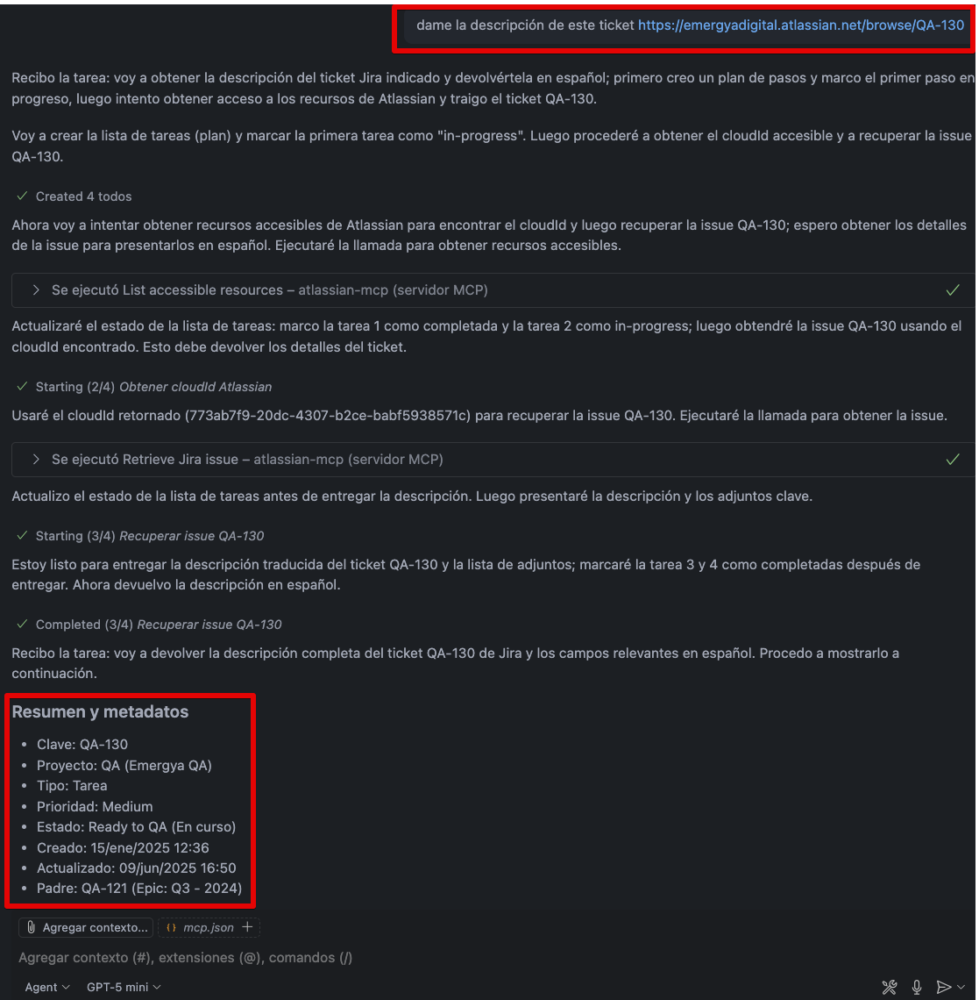
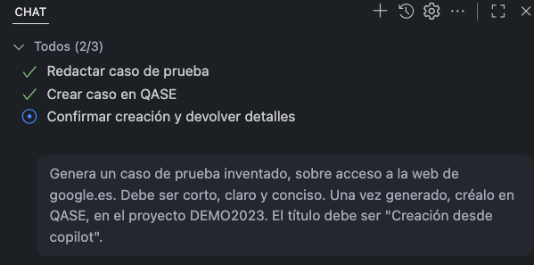
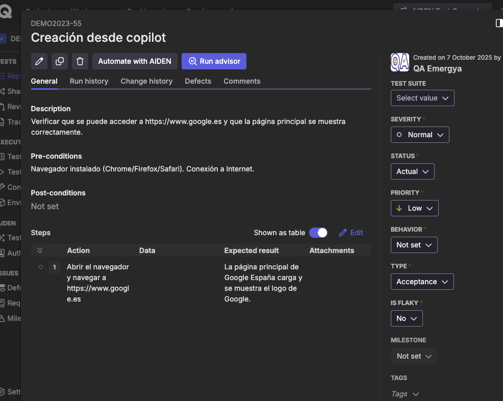
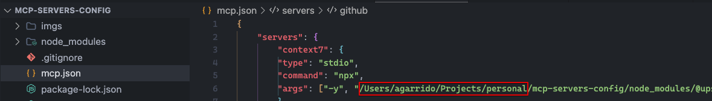

# mcp-servers-config

Repositorio de configuración para servidores MCP locales y remotos.

## Descripción
La finalidad de este repositorio es mantener una configuración global, exportable y centralizada en tu equipo local, intentando quitarle dependencia al MCP cliente elegido. Unificar los mcp-servers en uso, ya sean "studio" o "http". Añade facilidad a la hora de actualizar versiones de los distintos mcps-servers al recogerlos en un único proyecto, y de compartir configuración entre distintas personas y/o equipos propios a través de un repositorio único.

Este proyecto contiene archivos de configuración (`mcp.json`, `package.json`, etc.) para definir y gestionar servidores MCP que pueden ser consultados por VSCode u otros clientes MCP.

## Demo
<strong>Utilizando MCP Jira/Confluence</strong>

<strong>Utilizando MCP Qase</strong>

## Estructura
- `mcp.json`: Configuración de los servidores MCP (rutas, comandos, endpoints).
- `package.json`: Dependencias y scripts relacionados con la gestión de servidores MCP.

## Pre-requisitos
1. Node.js instalado.
2. Revisar `package.json` para añadir o eliminar los mcps-servers deseados.

## Uso
1. Clona este repositorio en tu máquina local.
2. Realiza un `npm install`.
3. Modifica `mcp.json` para añadir los tokens necesarios y además cambia la ruta absoluta del repositorio actual donde sea necesario (servers tipo "stdio principalmente"). Ejemplo:

4. Configura tu cliente MCP (VSCode, Cursor, etc.) para consultar este archivo de configuración, y si no es posible, simplemente copypastea el contenido de mcp.json donde lo requiera tu cliente MCP.

## Requisitos
- Node.js (recomendado instalar de manera global)
- Conocimientos básicos de MCP 🤠

## Aclaraciones
- Actualmente se están utilizando 2 tipos de "ejecuciones" en este proyecto, "stdio" y "http". Se ha optado por usar las remotas (http) para las que requieren de conexión para evitar el uso de tokens si se dispone de dicha posibilidad y las locales (stdio) para el resto ya que son las que se utilizarán habitualmente.

## Links útiles

| Nombre                   | URL documentación |
|--------------------------|-------------------------------|
| Aprende MCP desde 0          | [https://www.youtube.com/watch?v=wnHczxwukYY](https://https://www.youtube.com/watch?v=wnHczxwukYY) |
| @playwright/mcp          | [https://www.npmjs.com/package/@playwright/mcp](https://www.npmjs.com/package/@playwright/mcp) |
| @upstash/context7-mcp    | [https://www.npmjs.com/package/@upstash/context7-mcp](https://www.npmjs.com/package/@upstash/context7-mcp) |
| mcp-github               | [https://www.npmjs.com/package/@github/mcp](https://www.npmjs.com/package/@github/mcp) |
| mcp-atlassian            | [https://www.npmjs.com/package/@atlassian/mcp](https://www.npmjs.com/package/@atlassian/mcp) |
| mcp-qase (unofficial)           | [https://github.com/rikuson/mcp-qase](https://github.com/rikuson/mcp-qase) |

## Errores conocidos

	
<strong>❌ No es posible ejecutar npx desde tu cliente MCP</strong>

	<ul>
		<li><strong>Causa:</strong> Node.js no está instalado globalmente en tu equipo.</li>
		<li><strong>Solución:</strong> Instala Node.js de forma global desde <a href="https://nodejs.org/es/download/">nodejs.org</a> y asegúrate de que <code>npx</code> funciona en tu terminal.</li>
	</ul>

## Licencia
ISC

Copyright (c) 2025, agarrido

Github: agarpac
